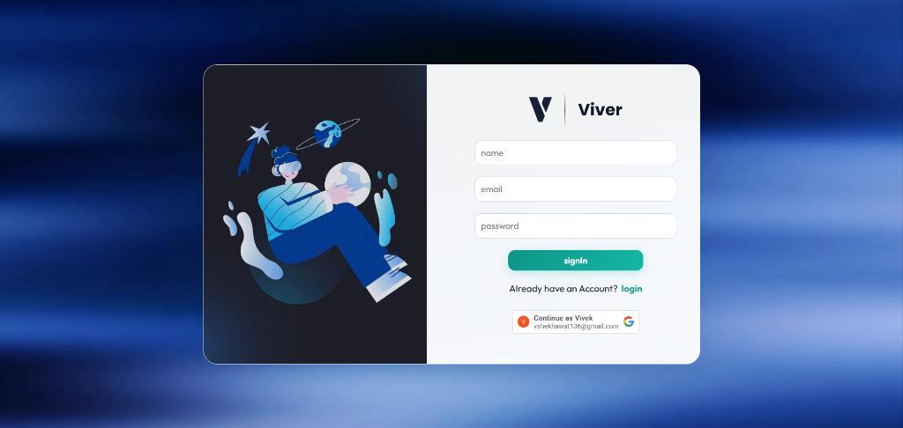
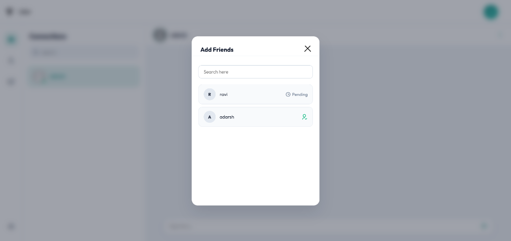
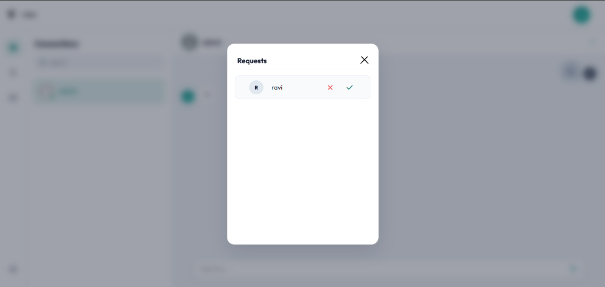
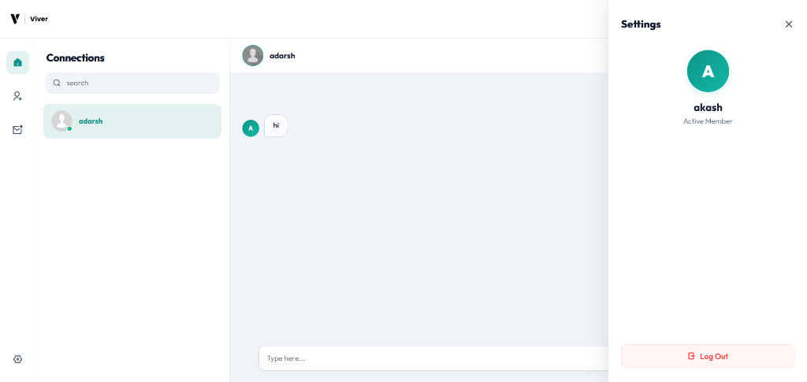
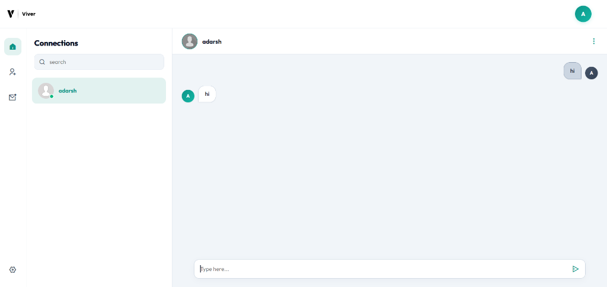

# Viver Chat App - Frontend

Welcome to the frontend application client for **Viver**, a premium, real-time web chat client. Viver features a sleek, responsive, and interactive user interface designed to deliver an exceptional user experience, complete with smooth animations, rich aesthetics, and instant real-time message delivery.

---

## 📋 Table of Contents

- [📸 App Interface & Screenshots](#-app-interface--screenshots)
- [✨ Core Features](#-core-features)
- [🔄 Application Flow](#-application-flow)
  - [1. Authentication Flow](#1-authentication-flow)
  - [2. Chat Dashboard Lifecycle](#2-chat-dashboard-lifecycle)
  - [3. Friend & Connection Lifecycle](#3-friend--connection-lifecycle)
  - [4. Message Delivery & Lifecycle](#4-message-delivery--lifecycle)
  - [5. Responsiveness & Mobile Flow](#5-responsiveness--mobile-flow)
- [🏗️ State Management & Context](#️-state-management--context)
  - [React Context (`contextForWebsocket`)](#react-context-contextforwebsocket)
  - [Local Storage Persistence](#local-storage-persistence)
- [🛠️ Tech Stack](#️-tech-stack)
- [⚙️ Configuration & Environment Variables](#️-configuration--environment-variables)
- [🏃 Getting Started](#-getting-started)

---

## 📸 App Interface & Screenshots

### 1. Login & Registration
Viver features a dual-mode login and signup window with a split-screen design. On the left is an futuristic illustration, and on the right is a modern input interface supporting standard credentials and single-tap **Google OAuth** authentication.


### 2. Main Chat Dashboard
The main dashboard has a minimal and professional aesthetic, featuring a clean left sidebar with active chat connections, an interactive search input, and a messaging window showing real-time chat histories and online badges.


### 3. User Settings & Status Panel
A slide-out drawer transitions from the right to reveal user profile details, active status indicators, and a secure logout action.


### 4. Interactive Friend Discovery
Users can dynamically search and send friend requests to others. The modal provides real-time feedback on user states (e.g. pending, friend, or add-friend options).


### 5. Friend Request Management
Manage incoming requests instantly. Users can review list of incoming invitations and approve or reject them, updating both clients in real-time.


---

## ✨ Core Features

- **Responsive Multi-Panel Layout**: Designed from scratch using modern HSL-based color design systems and flexible flexbox/grid components.
- **GSAP Micro-Animations**: Powered by GreenSock Animation Platform for premium transitions, modal entries, settings-drawer slide-ins, and hover-triggered button effects.
- **Dual Authentication**: Integrated standard email/password authentication and Google OAuth 2.0.
- **Interactive Connections**: Add friends, accept/reject requests, and manage friend lists directly from overlay modals.
- **WebSocket Gateway Client**: Synchronizes user relationships and handles message exchanges lines instantaneously without polling.
- **Message Selection & Deletion**: Advanced delete controls allowing users to select multiple messages and delete them either for "everyone" (sender only) or "just me".
- **Toast Notifications**: Built-in [React Hot Toast](https://react-hot-toast.com/) feedback for error reporting and confirmation popups.

---

## 🔄 Application Flow

### 1. Authentication Flow
- **Direct Login (Root `/`)**: Renders `<SubLogin Type='signIn' />` representing the login screen. Validates input fields using a custom validation array and sends a `POST` request to `/login`. Upon successful authentication, it sets the user's name in `localStorage` and redirects to `/allChats`.
- **Register / Signup (`/signIn`)**: Renders `<SubLogin Type='login' />` representing the registration screen. Validates name, email, and password (minimum 4 characters) and sends a `PUT` request to `/signUp`. On success, it redirects to the login screen.
- **Google OAuth Integration**: Enabled through `<GoogleOAuthProvider>`. Upon verification, the credential payload is sent to `/signUp/GoogleLogin`. The server returns session headers and username data. A quick temporary socket handshake is established to broadcast `newLogin` before steering the browser to `/allChats`.

### 2. Chat Dashboard Lifecycle
Upon mounting the main `/allChats` panel, the dashboard initializes:
1. **WebSocket Connection**: A connection is opened to `VITE_WEBSOCKET_URL`. 
2. **Initial Sync**: It registers event handlers for messages, and requests the user's friend list (`allFriendsToMe`) and pending requests (`pendingReqsForMe`).
3. **Presence and User Listing**: Queries relations of other users to populate the Search Modals correctly.

### 3. Friend & Connection Lifecycle
- **Discovery**: Clicking the Add Friend icon launches the search overlay (`PopUpForAllUsers.jsx`). Input query filters registered users. Clicking the `+` button sends a WebSocket event `addReq`, transitioning status to "Pending".
- **Inbox Approval**: Incoming requests display a notification dot. Clicking the Mail icon launches `PendingRequestsInbox.jsx`. Clicking the Checkmark sends an `ack` event over the WebSocket, adding the friendship to the database and prompting real-time view syncs on both clients. Rejections send a `DELETE` request to `/rejectReq`.
- **Relationship Termination**: Active connections can be unfollowed via the Settings side-bar or conversational dropdown menu, triggering a `removeFriend` WebSocket request.

### 4. Message Delivery & Lifecycle
- **Beginning Chat**: Clicking on a friend in the sidebar updates the state (`currTalkingName`). This triggers a `GET` request to `/beginChat/:from/:to`, loading the conversational history. The chat window immediately scrolls down to the latest message.
- **Sending Messages**: Typing and sending a text instantly appends a placeholder message locally with a client-generated `tempId` and pushes a `chat` event to the WebSocket. Once the server saves it, it returns `messageSentAck` with the final database ObjectID, which replaces the local `tempId`.
- **Deleting Messages**: Long-pressing or selecting a message allows the user to click "Delete for Me" or "Delete for Everyone" (if the message belongs to the user and is not already deleted). The action sends a `deletingChat` event carrying message IDs. The view is updated on both ends in real-time.

### 5. Responsiveness & Mobile Flow
- On screens $\le 600\text{px}$, the UI splits the sidebar and conversation area:
  - Selecting a connection calls `phoneDisplayRealChat()` which slides the chat panel into view and hides the sidebar.
  - Clicking the back arrow in the header calls `phoneDisplayGoneOnButtonClick()`, sliding the chat away and restoring sidebar visibility.
  - Sidebar icons collapse into a vertical dropdown menu.

---

## 🏗️ State Management & Context

### React Context (`contextForWebsocket`)
Viver uses a global React Context provider defined in `AllChats.jsx` to coordinate states across all modular child elements. This context manages:
- **Client Metadata**: Logged-in user's `name` and the `ws` socket connection.
- **Conversation State**: `currTalkingName` (active chat partner) and `contentTexts` (current conversation logs).
- **Modals & Overlays**: Search and typing text bindings (`findingSomeOne`, `searchingFriends`).
- **Counters & Notifications**: `pendingToMe` list, connection state tracker, and `unreadCounts`.
- **Selection State**: Active multi-message selections (`selectedMsgIds`, `isSelectionModeActive`).

### Local Storage Persistence
To ensure consistency across refreshes, Viver stores:
- `name`: Keeps track of the active user.
- `unreadCounts_<userName>`: Persists unread badge counts locally.

---

## 🛠️ Tech Stack

- **Framework**: [React 19](https://react.dev/) (via [Vite](https://vite.dev/))
- **Routing**: [React Router DOM](https://reactrouter.com/) (v7)
- **Animations**: [GSAP](https://gsap.com/) & `@gsap/react`
- **Authentication**: [@react-oauth/google](https://www.npmjs.com/package/@react-oauth/google) (Google Identity Services)
- **Styling**: Modern Vanilla CSS variables (curated HSL palettes, dark mode aesthetics, clean Outfit fonts)
- **Build System**: Vite (optimized HMR and bundles)

---

## ⚙️ Configuration & Environment Variables

Create a `.env` file in the root of the `/server/frontEndChatApp` folder:

```env
VITE_URL_SERVER="http://localhost:10000"         # Backend API host URL
VITE_WEBSOCKET_URL="ws://localhost:10000"       # Backend WebSocket host URL
VITE_GOOGLE_CLIENT_ID="your-google-oauth-client-id.apps.googleusercontent.com"
```

---

## 🏃 Getting Started

### 1. Prerequisites
- Ensure you have **Node.js** (v18+) installed.

### 2. Install Dependencies
Navigate to the frontend folder and run:
```bash
npm install
```

### 3. Run Development Server
Start the local server with hot module reloading:
```bash
npm run dev
```
Open your browser and navigate to `http://localhost:5173`.

### 4. Build for Production
Create an optimized production bundle inside the `dist` folder:
```bash
npm run build
```
You can preview the production build locally with:
```bash
npm run preview
```
